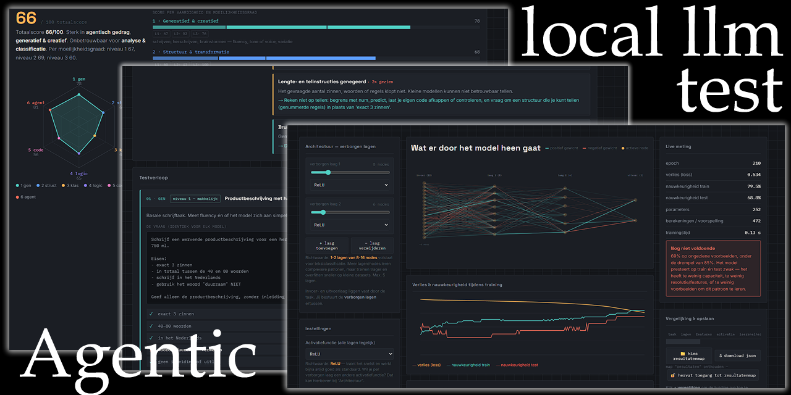
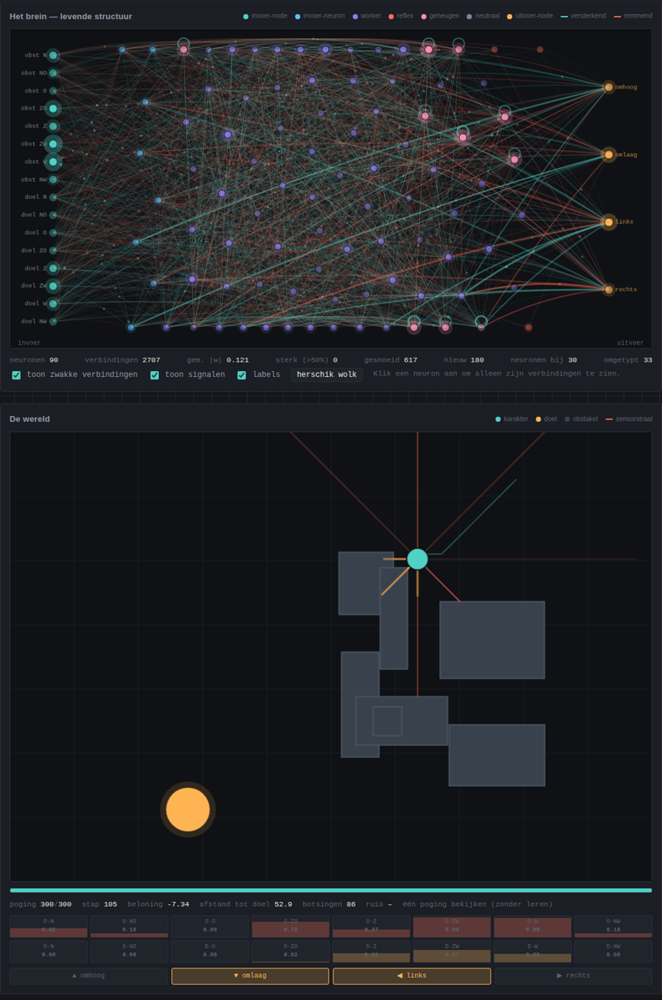
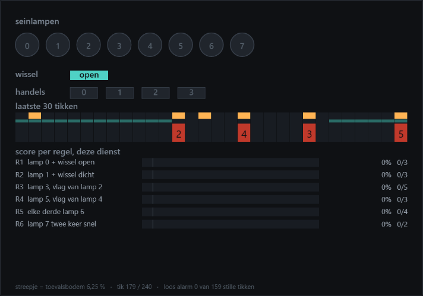
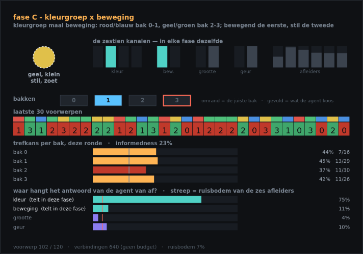

# AI Testing Tool — lokaal model lab



Een verzameling losse HTML-pagina's waarmee je **op je eigen hardware** kunt meten
wanneer een klein of slecht getraind model onderuit gaat, hoe zich dat uit, en wat je
eraan kunt doen. Geen server nodig, geen build, geen dependencies, geen `npm install`:
open een bestand in Chrome of Edge en het draait.

De centrale vraag achter dit project:

> Wanneer, hoe en waardoor gaat een te klein of slecht getraind netwerk slecht
> presteren, hoe herken je dat, en welke methodes kun je toepassen om de resultaten te
> verbeteren?

Er zitten inmiddels vier tests in, van "een gewoon statistisch script zonder AI" tot
een zelfstructurerend neuraal netwerk zonder lagen en zonder backpropagation.

## Snelstart

1. Clone of download deze map.
2. Start **`start-server.cmd`** (Windows). Dat serveert de map op
   `http://localhost:8080` en opent het hoofdmenu. Handmatig kan ook, vanuit deze map:
   `python -m http.server 8080`.
3. Kies een test in `index.html`.

Alleen de **Ollama LLM-test** heeft die webserver echt nodig. De andere drie werken ook
als je het bestand rechtstreeks vanaf schijf opent.

> **Waarom niet gewoon dubbelklikken?** Een pagina die je vanaf schijf opent (`file://`)
> stuurt `Origin: null` mee, en dat weigert Ollama standaard — de LLM-test krijgt dan
> geen verbinding. Via `localhost` speelt dat niet. Wil je toch vanaf schijf werken, zet
> dan `OLLAMA_ORIGINS` op `*` en herstart Ollama.

Voor de LLM-test heb je [Ollama](https://ollama.com/download) nodig met minstens één
model:

```bash
ollama pull llama3.2:3b
ollama run llama3.2:3b
```

De pagina bevat een uitschuifbaar vak met alle installatiestappen en een statusbolletje:
groen = verbonden, oranje = Ollama draait wel maar blokkeert de pagina (CORS), rood =
niet bereikbaar.

## De vier tests

| # | Test | Wat je meet | Nodig |
|---|---|---|---|
| 01 | **NN Layer Test** | Bouw zelf een klein neuraal netwerk (tot 5 verborgen lagen) op koffiereviews, spam, MNIST-cijfers of EMNIST-letters, en zoek de omslag tussen "te klein" en "goed genoeg". | dataset voor taak C/D |
| 02 | **Ollama LLM-test** | 18 vaste opdrachten voor een lokaal draaiend taalmodel: 6 vaardigheden × 3 moeilijkheidsgraden, met faalpatronen en remedies. | Ollama + webserver |
| 03 | **Statistische modellen** | Acht klassieke modellen zonder AI — van rechte lijn tot random forest, kernel-SVM en k-means — live op echte datasets. Laat zien hoe ver je komt met een gewoon script. | niets |
| 04 | **Basic Brain Test** | Een neuraal netwerk zónder lagen dat al spelend leert een doel te bereiken, plus twee andere spellen op hetzelfde brein: het Seinhuis (geheugen op vier tijdschalen) en de Proeftuin (dezelfde zintuigen, wisselende betekenis). Zie hieronder. | niets |

Bij elke test hoort een resultatenpagina waarmee je runs naast elkaar legt.

### Test 02 — de LLM-testbatterij in het kort

18 vaste opdrachten = **6 vaardigheden × 3 moeilijkheidsgraden**, altijd exact dezelfde
vragen, met `temperature 0` en `seed 42`, zodat verschillen door het model komen en niet
door toeval.

| # | Vaardigheid | Waar je het aan ziet als het misgaat |
|---|---|---|
| 1 | Generatief & creatief | tel- en verbodsinstructies worden genegeerd |
| 2 | Structuur & transformatie | JSON met uitleg eromheen, verkeerde sleutels, verzonnen getallen |
| 3 | Analyse & classificatie | verzonnen labels, wisselende uitkomsten bij herhaling |
| 4 | Logica & redeneren | plausibel maar fout getal, afgeleid door irrelevante info |
| 5 | Techniek & code | code draait niet, of zakt op de randgevallen |
| 6 | Agentisch gedrag | verkeerde of verzonnen tool, geen herstel na een fout |

De code-opdrachten worden **echt uitgevoerd** in een sandbox met time-out, en de
zwaarste agent-opdracht is een tweetraps-loop waarin de eerste tool-aanroep faalt en het
model zelf een alternatief moet kiezen. Per model krijg je een totaalscore, een
radarprofiel per vaardigheid, een "waar valt het om"-grafiek per moeilijkheidsgraad, en
per gevonden faalpatroon een uitleg plus een concrete remedie.

Volledige details in [DOCUMENTATIE.md](DOCUMENTATIE.md).

### Test 03 — statistische modellen

Acht modellen, met de hand geïmplementeerd, zonder enige bibliotheek: kleinste kwadraten
met ridge, polynomiale regressie met LOOCV, CART, random forest met OOB-score,
logistische regressie, k-NN, kernel-SVM via vereenvoudigde SMO, en k-means met
k-means++ en silhouetscore. Vier echte datasets zitten in het bestand ingebakken.

Je kunt er de klassieke lessen mee laten zien, en ze kloppen ook echt: schaling
uitzetten bij logistische regressie laat de score van 89% naar 36% zakken — onder de
basislijn; een beslisboom met diepte 8 haalt R² = 1,000 op de trainingsset terwijl de
testset instort; en polynomiaal graad 8 gaat van LOOCV 0,36 naar 0,96 door ridge.

## Test 04 — Adaptive Neural Graph (ANG)

De nieuwste en eigenzinnigste test. Een brein dat **geen lagen** heeft maar een gerichte
graaf is die zichzelf tijdens het leren herbouwt, en dat een klein 2D-spel speelt: een
karakter moet een doel bereiken zonder tegen obstakels te botsen. Op hetzelfde brein staan
inmiddels twee andere spellen: het *Seinhuis* (stap 17) en de *Proeftuin* (stap 19) — zie
verderop.

> **Stand op 20 september 2026 (paper 3.0).** Het doel van ANG is niet een beter neuraal
> netwerk te zijn, maar te onderzoeken onder welke omgevingsdruk een lerend systeem zijn
> eigen rekenstructuur verbouwt, en of dat verbouwen zich terugbetaalt. Op beide spelen is
> het antwoord tot nu toe **nee**: niet in eindprestatie, niet in geheugen, niet in
> monsterefficiëntie, niet in aanpassingssnelheid, en ook niet als de herstructurering op
> een signaal uit de omgeving wordt aangestuurd. Wat wél iets oplevert staat per sectie
> hieronder, met de meting erbij.
>
> **Afgesloten op 21 september 2026 (paper 4.0).** Een derde spel, de proeftuin, maakte de
> situatie die de eerste twee misten: dezelfde zintuigen, een verschuivende betekenis, en
> capaciteit die alleen verplaatst kan worden. De kalibratie liet zien dat de wolk daar na
> de eerste fase haar leervermogen verliest — ook met bevroren structuur, terwijl dezelfde
> leerregel in een gelaagd net gewoon herleert — en dat verbouwen het herleren slechter
> maakt. Daarmee is het idee op drie taken nergens bevestigd, en is het werk afgesloten.
> Wat blijft is het gereedschap en een lijst faalvormen; zie **Wat dit project oplevert**
> onderaan dit deel.



**Invoer en uitvoer liggen vast.** Zestien invoer-nodes: acht raycast-sensoren voor de
nabijheid van obstakels in acht windrichtingen, en acht die het doel als
richting-met-nabijheid coderen. Vier uitvoer-nodes: omhoog, omlaag, links, rechts — elk
een *kans* waaruit de actie geloot wordt.

**De wolk ertussen bepaal je zelf.** Je kiest hoeveel neuronen er zijn en van welke
soort, en elke soort heeft eigen regels over wat hij mag verbinden:

| soort | ingang | uitgang |
|---|---|---|
| invoer-neuron | uitsluitend invoer-nodes | vrij |
| worker | vrij | vrij — moet altijd de meerderheid zijn |
| reflex / instinct | uitsluitend invoer-neuronen | uitsluitend uitvoer-nodes |
| geheugen | vrij | altijd eerst zichzelf (lekkende integrator), daarna vrij |
| neutraal | vrij | vrij — tijdelijk, tot het systeem een soort toewijst |

De enige harde eis aan de bedrading is dat elke invoer-node ergens naartoe gaat en elke
uitvoer-node ergens vandaan komt. Er is geen minimum of maximum aantal verbindingen per
neuron.

**Leren zonder backpropagation.** De graaf zit vol lussen en verandert bovendien van
vorm, dus een vaste rekengrafiek bestaat niet. In plaats daarvan:

```
elke tik twee keer doorrekenen: één keer schoon, één keer met ruis
    δ = x_ruis − x_schoon                       de duw die exploratie gaf
    voor de vier knoppen exacter:  δ = geloten actie − kans
spoor bijhouden per verbinding:
    e ← λ·e + (1−λ)·x_pre·δ_post
    x_pre = de toestand vóór de laatste propagatiestap, niet erna:
            die activatie bracht δ_post voort (zie het logboek van 9 september)
en bijstellen naar de afwijking van een lopende basislijn:
    Δw = η · (r − r̄) · e
```

Drie remmen houden dat stabiel: de stap per keer is begrensd (*niet abrupt*), de
aanpassing wordt gedempt naarmate een gewicht zijn plafond nadert (*niet oneindig
versterken*), en alles zakt per poging een beetje terug naar nul (*vervagen*).

**Doet die regel wat hij belooft?** Deels — en dat is nagemeten in plaats van aangenomen.
Op een miniatuurbrein met bevroren topologie is per gewicht de echte gradiënt numeriek
bepaald en met de update vergeleken (`tests/gradcheck-stap3.js`, figuur in
`docs/fig2-gradcheck.png`). Voor de vier knoppen, waar de formule exact is, wijst de
update precies de goede kant op (cosinus 0,99–1,00, tegen het meetbare plafond aan). Voor
de wolk, waar node-perturbatie wordt gebruikt, wijst hij de goede kant op maar veel
grover (0,27–0,83) — en, belangrijker: hij is er **twee ordes te klein**, doordat de
normalisatie 1/Var(ξ) ontbreekt die bij node-perturbatie hoort. Met één leersnelheid
krijgt de wolk daardoor nauwelijks een update, terwijl daar het grootste deel van de
echte gradiënt ligt. Die factor er zomaar bij zetten maakt het overigens *slechter*: de
leersnelheid en de stapbegrenzing zijn stilzwijgend op de bestaande verhouding
afgesteld. Dat rechtzetten is een eigen experiment, geen knop die je even omzet.

**De structuur verandert mee.** Verbindingen die te lang te zwak zijn worden gesnoeid en
er groeien nieuwe bij. Loopt het leren vast, dan komen er neuronen bij — die zijn
*neutraal* en krijgen bij de volgende opruimronde de soort die het beste past bij de
bedrading die ze inmiddels hebben. Een neuron dat al zijn verbindingen kwijtraakt wordt
weer neutraal en kan opnieuw worden ingezet.

**Wat je eraan afleest.** Naast de score: het kortste pad van zintuig naar knop, het
aantal werkende reflexbogen, het aantal terugkoppellussen, hoeveel neuronen er
werkelijk meedoen, en welke van de zestien sensoren het brein feitelijk negeert. Elke
run wordt met alle instellingen én de volledige eindstructuur weggeschreven, zodat
`brein-resultaten.html` het netwerk opnieuw kan tekenen zonder de training over te doen.

**Wat het haalt.** Met de standaardinstellingen (60 neuronen, startdichtheid 35, 7
obstakels, 500 pogingen) gemeten over **zestien onafhankelijke breinzaden**:

| grootheid | gemiddelde ± 95% | spreiding |
|---|---|---|
| succes laatste 20 pogingen | 87,2% ± 4,6 | sd 8,7% |
| toets op 20 onbekende werelden | 68,1% ± 3,6 | sd 6,8% |
| **benchmark, 500 werelden, geleerd beleid** | **65,4% ± 2,0** | sd 3,8% |
| benchmark, altijd de waarschijnlijkste knop | 52,3% ± 3,0 | sd 5,7% |
| rekentijd per run | 11,4 s | |

Twee ijkpunten op diezelfde 500 werelden: een **willekeurig beleid** haalt 0,0%, een
**zuiver reactieve agent** — dezelfde zintuigen, geen geheugen, geen leren, naar het doel
toe en van wat vlakbij staat af — haalt 38,6% ± 4,3. Het netwerk zit daar 27 procentpunt
boven, ruim buiten beide intervallen.

Twee dingen om vast te houden. **De spreiding tussen zaden** (sd 8,7% op de
trainingsscore) betekent dat een enkele run niets bewijst en dat een verschil van tien
procentpunt pas boven de ruis uitkomt bij ruwweg zestien runs per conditie. En **het
toeval hoort bij het beleid**: steeds de waarschijnlijkste knop nemen kost 13,1 ± 2,3
procentpunt (p < 0,001) — dat is dus geen "hetzelfde beleid zonder ruis" maar een ander
en slechter beleid. De ruwe meting staat in `experimenten/runs.csv`, conditie
`benchmark-standaard`, met de samenvatting in `experimenten/benchmark.json`.

**Waarop getoetst wordt.** Twintig toetswerelden zijn een goedkoop signaal tijdens het
afstellen, geen bewijs: bij een score rond 70% is het 95%-interval van twintig
trekkingen ongeveer ± 20 procentpunt. Daarom is er een **vaste benchmarkset** van 500
werelden uit een eigen zaadreeks, gescheiden van de trainingswerelden én van die
twintig, en nooit gebruikt om instellingen te kiezen. Elke wereld wordt drie keer
gespeeld omdat het beleid geloot wordt; het interval gaat over de wérelden, niet over de
speelbeurten. Daarmee zakt de onzekerheid van één meting naar ± 3,6 procentpunt. De
verzameling ligt vast in `experimenten/benchmark-werelden.json`.

**Draagt de graafstructuur eigenlijk iets bij?** Dat is de eerste vraag die een kritische
lezer stelt, en het antwoord is op deze taak: nee. Vijf condities met **exact dezelfde
leerregel**, dezelfde wereldzaden en dezelfde benchmark, 16 zaden elk:

| conditie | benchmark | argmax | verb. | pad | rekentijd |
|---|---|---|---|---|---|
| ANG, wolk met plasticiteit | 65,4% ± 2,0 | 52,3% ± 3,0 | 2996 | 2,00 | 7,0 s |
| ANG, wolk bevroren | 67,5% ± 1,3 | 50,3% ± 2,7 | 2650 | 2,00 | 5,8 s |
| gelaagd, 1 × 150 | 66,9% ± 0,5 | 40,9% ± 1,5 | 3000 | 2,00 | 5,3 s |
| gelaagd, 2 × 46 | 62,4% ± 2,6 | 49,7% ± 2,6 | 3036 | 3,00 | 7,2 s |
| gelaagd, 1 × 60 | 67,0% ± 1,0 | 42,8% ± 1,8 | 1200 | 2,00 | 2,7 s |

Een vaste stapel lagen met hetzelfde parameterbudget doet het net zo goed als de wolk
(p = 0,76), en de structurele plasticiteit uitzetten kost niets (p = 0,11) maar scheelt
wel rekentijd. Het enige structurele effect dat boven de ruis uitkomt is **padlengte**:
twee lagen in plaats van één kost 5,1 procentpunt (p = 0,003) — bij propagatiediepte 1 is
elke boog een tijdstap, dus dat is reactietijd, geen capaciteit. Alles boven de reactieve
ondergrens van 38,6% is dus toe te schrijven aan de leerregel, niet aan de graaf. Ruwe
meting: `experimenten/basislijnen.json`.

**En wat geef je op door géén backpropagation te gebruiken?** Dezelfde vraag omgekeerd:
topologie vast, alleen de schatter wisselt. Node-perturbatie *schat* wat een verborgen
knoop bijdroeg; terugpropagatie *rekent* het uit. Verder is alles identiek — hetzelfde
spoor, dezelfde basislijn, dezelfde begrensde stap, dezelfde vervaging, hetzelfde
startbrein — en elke conditie draait op de leersnelheid die een aparte veeg op de goedkope
toets voor haar koos.

| conditie | η | benchmark | gewichten | kanten tot 80% | tijd |
|---|---|---|---|---|---|
| ANG, de wolk | 0,004 | 63,2% ± 3,0 | 3068 | 483 M | 7,1 s |
| MLP 16-16-4, perturbatie | 0,008 | 39,3% ± 5,3 | 320 | 180 M | 3,0 s |
| MLP 16-16-4, **backprop** | 0,016 | **66,7% ± 0,6** | 320 | **11 M** | 1,4 s |
| MLP 16-32-32-4, perturbatie | 0,004 | 41,7% ± 4,9 | 1664 | 1,3 G | 10,4 s |
| MLP 16-32-32-4, backprop | 0,008 | 64,9% ± 1,1 | 1664 | 74 M | 3,5 s |
| Elman-16, perturbatie | 0,004 | 42,3% ± 5,0 | 576 | 297 M | 2,6 s |
| Elman-16, backprop | 0,008 | 66,3% ± 1,2 | 576 | 22 M | 1,2 s |

De exacte gradiënt is op alle drie de netten meer dan **twintig procentpunt** beter
(p < 0,001). Node-perturbatie betaalt dat in capaciteit: met 16 verborgen knopen haalt zij
39%, met 150 knopen 67% — terwijl backprop met diezelfde 16 knopen al op 67% zit. En op
rekenkosten is het geen wedstrijd: een MLP van 320 gewichten haalt de score van de wolk
voor **een 43e deel van het rekenwerk**. De hypothese uit het werkplan dat een klein MLP
hier op rekenkosten wint, is dus gemeten in plaats van vermoed, en zij komt uit.

Rekenkosten worden in **vier gescheiden grootheden** gerapporteerd, want zij vallen zelden
samen: kanten-bezoeken per lerende spelstap, per inferentiestap, omgevingsstappen tot 80%
succes (sample-efficiëntie) en kanten-bezoeken tot diezelfde drempel (rekenefficiëntie),
met wandkloktijd en actieve verbindingen ernaast. Eén kanten-bezoek is één keer een gewicht
aanraken. Ruwe meting: `experimenten/rekenkosten.json` en `experimenten/lr-veeg-stap6.json`.

### Vier varianten van de leerregel — en wat er wél uit komt

De leerregel zelf heeft sinds stap 7 vier schakelaars, elk los aan te zetten in de pagina
of via de experimentloper (`criticOn`, `perturbFrac`, `catPolicy`, `perturbGain`):

| variant | benchmark geloot | argmax | stappen tot 80% |
|---|---|---|---|
| de regel zoals zij was | 65,6% ± 2,6 | 53,5% ± 3,5 | 19,0 k |
| **criticus** — een lineaire *V(s)* op de 16 sensoren, TD(0), in plaats van één lopend gemiddelde | 60,9% ± 3,5 | 53,0% ± 3,6 | 32,9 k |
| **schaarse perturbatie** — per tik maar ¼ van de wolk verstoren | 66,6% ± 2,1 | 51,8% ± 3,8 | **13,5 k** |
| **categorisch beleid** — één softmax over 9 elkaar uitsluitende acties | 68,8% ± 1,9 | **61,3% ± 3,3** | 30,7 k |
| **perturbGain = 10** — de ontbrekende 1/Var(ξ) uit stap 3 | 33,3% ± 6,3 | 46,6% ± 5,3 | 116,4 k |

Twaalf zaden, elke variant op haar eigen leersnelheid uit een veeg van zes waarden. Twee
dingen komen boven de ruis uit, en het zijn niet de dingen waarop gehoopt werd. **Schaarse
perturbatie haalt dezelfde eindscore met een factor 1,4 minder ervaring** (p = 0,007): het
is de eerste ingreep in dit project die iets oplevert in plaats van kost, en precies wat de
theorie voorspelt, want de variantie van een perturbatieschatter groeit met het aantal
knopen dat tegelijk beweegt. En het **categorische beleid heeft het toeval minder nodig**:
het gat tussen geloot en argmax zakt van 12,1 naar 7,5 procentpunt (p = 0,009) — logisch,
want met onafhankelijke knoppen is "op én neer" onder argmax een verlammende actie waar het
gelote beleid met kans omheen komt.

De **criticus levert niets op** — 4,7 pp lager, méér spreiding tussen de zaden, en bijna
twee keer zoveel ervaring nodig — en dat staat er even hard bij: de simpelste diagnose, dat
het probleem in de toestandsloze basislijn zat, is daarmee uitgesloten. `perturbGain` blijft
rampzalig, ook mét een eigen leersnelheidsveeg. Ruwe meting: `experimenten/leerregel.json`
en `experimenten/lr-veeg-stap7.json`.

> **Herzien na stap 8.** In de eerste versie van deze tabel stond "factor 4,9". Die kwam
> voort uit een fout in de maat *stappen tot 80%*: de drempel werd afgelezen op het succes
> over de laatste twintig pogingen, óók wanneer er nog geen twintig pogingen waren, zodat
> een run met een gelukkige eerste poging "80% gehaald na 1 poging" kreeg. Dat gebeurde in
> negen van de twaalf runs van juist deze conditie. De maat is hersteld en voor alle runs
> opnieuw uit de bewaarde historie afgeleid (`tests/migreer-tot80.js`), zonder te
> hertrainen. De bevinding blijft staan, maar kleiner.

### Het doel verdwijnt — de taakas, en waar het ophoudt

Alle metingen hierboven gebruiken een taak waarin het doel de hele poging zichtbaar is.
Daar valt niets te onthouden, dus ze zeggen ook niets over geheugen. Sinds september 2026
zit er een knop op de wereld: **het doel is tien stappen te zien en daarna k stappen niet,
en zo door**. Op 0 is het spel bit voor bit het oude spel. De beloning verandert niet mee —
alleen de wáárneming valt weg. De reactieve ijkagent wordt even blind en zakt van 40% naar
3%.

Daarnaast is er een geheugenmaat die **niet aan de neuronsoorten van dit model hangt**.
Dezelfde getrainde agent speelt honderd verse werelden twee keer met dezelfde toevalsreeks:
één keer met het doel de eerste twintig stappen zichtbaar, één keer nooit zichtbaar. Het
enige verschil is informatie die de agent ooit gehad heeft. De **geheugenhorizon** is het
aantal stappen dat de eerste run de tweede blijft verslaan op koers naar het doel. Nul
betekent niet "geen geheugen-neuronen" maar "geen gedrag dat op onthouden lijkt" — en dat
is op een GRU of Elman met exact dezelfde code te meten.

| architectuur | altijd zicht | 10 donker | 20 donker | 40 donker |
|---|---|---|---|---|
| ANG, plasticiteit aan | 65,6% | 27,4% | 9,9% | 2,8% |
| ANG, structuur bevroren | 67,5% | 31,2% | **13,7%** | **5,4%** |
| vast net zónder terugkoppeling, backprop | 66,7% | 65,2% | 26,1% | 14,5% |
| vast recurrent net, BPTT | 66,6% | **77,8%** | **75,4%** | **39,8%** |

*geheugenhorizon in stappen: ANG 25 → 2, ANG bevroren 16 → 4, vast net zonder
terugkoppeling 0 op elke stand, vast recurrent net 22 → 43 → 42 → 29.*

Drie dingen. **De maat werkt**: een net zonder enige terugkoppeling haalt op élke stand
exact nul, een recurrent net niet (p < 0,001). **ANG stort in**, en erger dan een net dat
helemaal geen geheugen heeft (−37,7 pp bij 10 donker) — ook ná een eigen
leersnelheidsveeg per stand. En **structurele plasticiteit is hier een kostenpost**: de
bevroren variant scoort hóger bij 20 en 40 donker (+3,8 en +2,5 pp, Holm 0,024 en 0,010).

Het scherpste detail zit in de geheugenmaat: ANG haalt horizon 25 op de taak waar
onthouden niets oplevert, en 2 zodra de taak het vraagt. Het vaste recurrente net doet het
omgekeerde. De architectuur mét geheugen-neuronen verliest haar geheugengedrag juist onder
geheugendruk — een aanwijzing dat die neuronsoorten namen zijn en geen functies. De
voorspellingen stonden vóór de meting in git (`tests/stap12-condities.js`); dit is de
onwaar-tak van voorspelling 4, en die stond er uitgeschreven bij. Ruwe meting:
`experimenten/taakas.json` en `experimenten/lr-veeg-stap12.json`.

### Wat elk onderdeel bijdraagt — de ablatiereeks

Tien condities die elk één onderdeel weglaten en de rest laten staan; 16 zaden, 500
pogingen, benchmark van 500 werelden, één leersnelheid voor alle tien. Omdat negen
condities tegen dezelfde referentie een familie toetsen is, krijgt elke maat een
**Holm-correctie** over die negen — zonder correctie is er bij negen toetsen ongeveer 37%
kans dat er eentje toevallig uitkomt.

| conditie | benchmark geloot | Δ | Holm | argmax |
|---|---|---|---|---|
| volle model | 65,4% ± 2,0 | — | — | 52,3% ± 3,0 |
| geen geheugen-neuronen | 65,9% ± 1,1 | +0,5 | 1,00 | **44,8% ± 2,2** |
| geen reflex-neuronen | 65,2% ± 1,9 | −0,2 | 1,00 | 49,4% ± 3,3 |
| geen invoer-neuronen | 60,4% ± 6,0 | −5,0 | 1,00 | 48,4% ± 4,8 |
| geen snoeien | 66,6% ± 2,0 | +1,2 | 1,00 | 49,3% ± 3,2 |
| geen aangroei van verbindingen | 63,9% ± 2,5 | −1,5 | 1,00 | 51,7% ± 3,6 |
| geen neuronale groei | 64,4% ± 2,6 | −1,0 | 1,00 | 52,0% ± 3,4 |
| geen hertypering | 65,1% ± 2,0 | −0,3 | 1,00 | 48,8% ± 3,7 |
| **strenge invoer** | **41,5% ± 8,5** | **−23,9** | **0,0002** | 43,1% ± 7,0 |
| vaste structuur | 67,5% ± 1,3 | +2,1 | 0,91 | 50,3% ± 2,7 |

**Eén onderdeel doet er aantoonbaar toe, en het is de bedradingsgrammatica — die kost.**
Alles via een invoer-neuron laten lopen zakt 23,9 procentpunt en heeft ruim drie keer
zoveel ervaring nodig. De oorzaak is capaciteit, niet latentie: het aantal kanten vanaf
een invoer-node zakt van 627 naar 165, want zestien zintuigen moeten door gemiddeld negen
invoer-neuronen.

**Geheugen-neuronen weglaten raakt niet de gelote score maar de vorm van het beleid:**
geloot niets, onder argmax −7,6 pp (p = 0,0019, Holm 0,017). **Verder komt er niets boven
de ruis uit** — snoeien, aangroei, groei en hertypering staan alle vier op Holm 1,00, ook
op monsterefficiëntie. Stap 5 mat dat al voor de plasticiteit als geheel; nu is het per
mechanisme uitgesplitst en is er niemand aan te wijzen.

Dat hoort bij *deze taak*: het doel is altijd zichtbaar en niets hoeft binnen één tik, dus
geheugen en reflex hebben er per constructie niets te doen. De ablaties krijgen pas
betekenis op een taak met twee tijdschalen.

Elke conditie bewijst in het resultaatbestand dat zij is wat zij zegt te zijn — nul
geheugen-, reflex- of invoerneuronen, nul gesnoeid, nul bijgegroeid, en zo verder, 16/16
runs per conditie. Dat is geen formaliteit: bij het schrijven van deze reeks bleek dat de
strenge-invoerconditie tot dan toe alleen vanuit het vinkje in de pagina werkte en niet
vanuit de experimentloper. Ruwe meting: `experimenten/ablatie.json`.

### Hoe groot moet het netwerk zijn? — de oorspronkelijke vraag

Vijf groottes (8, 16, 30, 60, 120 neuronen) × drie startdichtheden × twee taakstanden
(**A**: doel altijd zichtbaar, **B-20**: doel tien stappen aan en twintig uit), 8 zaden per
cel, de leersnelheid per cel geveegd op eigen zaden. Beste dichtheid per grootte:

| neuronen | benchmark taak A | benchmark taak B-20 |
|---|---|---|
| 8 | 26,5% ± 11,5 | 5,4% ± 2,5 |
| 16 | 54,1% ± 4,0 | 8,8% ± 1,9 |
| 30 | 58,3% ± 6,0 | 10,4% ± 2,3 |
| **60** | **68,5% ± 4,4** | 14,0% ± 2,9 |
| 120 | 67,8% ± 1,3 | **18,5% ± 7,3** |

**Te klein is veel duurder dan te groot** — het omgekeerde van wat er vooraf was
opgeschreven. Van 60 terug naar 8 neuronen kost 42,0 procentpunt op taak A, doorschalen
naar 120 slechts 0,7. De vuistregel "neem hem ruim" klopt hier dus. Zonder geheugendruk ligt
het optimum bij 60 neuronen; mét geheugendruk ligt het op de rand van het raster, en dat is
geen optimum: alleen "tot 120 blijft meer beter".

**Waaraan herken je een verkeerd gedimensioneerd netwerk?** De rangcorrelatie met de score,
bepaald op de zwakste van de twee taken: de **geheugenhorizon** wint (0,78 op A, 0,70 op
B-20), omdat hij meet wat het netwerk kán en niet wat erin zit. Het aantal **losgeraakte
neuronen** wisselt van teken tussen de taken (−0,62 op A, +0,21 op B-20) en is als losse
diagnose onbruikbaar. Bijvangst: onder ongeveer dertig neuronen is *dichtheid* geen knop
meer maar een gevolg van de grootte, omdat het aantal legale verbindingen dan het plafond
vormt. Ruwe meting: `experimenten/capaciteitsraster.json`.

### Verbouwen midden in het leven — omslagproef, structuur tegen gedrag, en een signaal

**De omslagproef (stap 13).** Eén doorlopend leven van 900 pogingen zonder reset: 300 keer
het doel altijd zichtbaar, 300 keer knipperend, 300 keer weer zichtbaar. Vijf condities ×
twaalf zaden.

| conditie | hersteltijd (pogingen) | behoud van taak A (pp) |
|---|---|---|
| ANG | 26,8 | −13,8 |
| ANG, structuur bevroren | 32,4 | −12,7 |
| ANG, zonder snoeien | 21,3 | −11,6 |
| Elman-16, backprop | 1,5 | −2,2 |
| MLP 16-16-4, backprop | 12,3 | +0,7 |

ANG herstelt niet aantoonbaar sneller dan de bevroren variant (p = 0,30, na Holm 0,60), en
vergeet niet meer (p = 0,84): het vergeten zit in de leerregel en de graaf, niet in het
verbouwen. De herstructurering loopt op een **klok** en piekt niet na een omslag. Let op:
de snelle hersteltijd van de vaste netten meet vooral dat zij **niets hadden om van te
herstellen** — bij hen meet die maat de afwezigheid van een verstoring, niet de snelheid
van aanpassen. Data: `experimenten/omslag.json`.

**Structuur tegen gedrag (stap 14).** Geen nieuwe metingen, wel vier nieuwe vragen aan de
bestaande runs. De gepoolde correlatie tussen aantal verbindingen en score is 0,68, maar
binnen elke taakstand apart loopt hij van −0,05 tot 0,63: de pool meet vooral welke *taak*
een run had. Binnen één leven stabiliseert de structuur gemiddeld zo'n **honderd pogingen
vóór** het gedrag (12 van 12 levens, p = 0,0005). Twaalf verschillende beginwolken
eindigen op een smalle band van vergelijkbare organisaties (rho tussen
organisatieverschil en scoreverschil: 0,145). En de klok is niet blind: de hoeveelheid
verbouwing volgt lokale stagnatie (rho = −0,32, 24 van 24 levens), alleen kijkt zij naar
het verkeerde signaal om een omslag te herkennen. Data: `experimenten/structuurgedrag.json`.

**Herstructureren op een signaal uit de omgeving (stap 16).** De klok is vervangen door
een detector die de statistiek van de zestien invoerkanalen bewaakt. Hij ziet de terugslag
naar de zichtbare taak in **12 van de 12 levens**, gemiddeld 3,2 pogingen na de omslag, en
de herstructurering wordt daar 17 keer zo dicht. **Het herstel verandert er niet van**:
30,3 ± 8,4 pogingen tegen 26,8 ± 8,4 voor de klok (Holm 1,00), en ook niet tegenover een
klok met per zaad precies evenveel verbouwrondes (29,4 ± 7,6). Daarmee is de negatieve
bevinding niet meer aan de aansturing toe te schrijven. Twee voorbehouden: de detector
ziet alleen de terugslag en niet het donker worden, en alle hersteltijden liggen tussen 27
en 32 pogingen, dus er is weinig ruimte voor een voordeel. Data:
`experimenten/signaalsturing.json`.

### Een tweede spel: het Seinhuis (stap 17–18)

Een taak zonder ruimte en zonder navigatie, gebouwd om de aanspraak op meerdere
tijdschalen tegelijk te toetsen. De agent is een seinhuiswachter: zestien invoerkanalen
(acht seinlampen, de wisselstand en **zeven afleiders** die nergens over gaan), vier
handels, en zes regels met tijdschalen van één tik tot zeventig tikken. Goed is: de
gevraagde handel ingedrukt én de andere drie niet. Elke handel wordt door twee regels
gebruikt, zodat hij geen verklikker van de regel kan zijn.



De score is **Youdens J per regel**: 0 betekent dat de reactie niet van de voorwaarde
afhangt, 100 dat zij perfect is. De eerste twee scoredefinities deugden niet — een
reflexspeler haalde 97% op een telregel en een muntspeler 51% — en beide staan nu als
controle op nul in `tests/test-stap18.js`. Bij het bouwen bleek bovendien dat de
"Elman met backprop door de tijd" uit stap 6 in werkelijkheid was afgekapt op één tik;
echte BPTT is gebouwd (gradiënt-cosinus 1,000000) en de correctie staat in de paper.

Afsluitende meting, zes condities × twaalf zaden, met de voorspellingen vooraf in git:

| conditie | R1 | R2 | R3 | R4 | R5 | R6 | totaal |
|---|---|---|---|---|---|---|---|
| ANG | −5 | −5 | −95 | −95 | −7 | −7 | −36 |
| ANG, bevroren | −3 | −2 | −97 | −97 | −3 | −3 | −34 |
| MLP-32, geen geheugen | **75** | **91** | −3 | −3 | −2 | −1 | 26 |
| Elman-32, afgekapt op 1 tik | 55 | 65 | −18 | −34 | −2 | 21 | 15 |
| Elman-32, echte BPTT | 65 | 68 | −12 | −29 | −1 | 0 | 15 |
| Elman-64, echte BPTT | 25 | 17 | −18 | −47 | −19 | −1 | −7 |

**Geen enkele architectuur leert een regel die geheugen vraagt** (24 toetsen, na Holm geen
enkele boven nul), ook niet een recurrent net met echte BPTT. De recurrente netten zijn
bovendien bimodaal over de zaden — perfect of ingestort — en ANG bleef overal stil. Daarom
is spel 2 afgesloten: er is geen tegenstander die de latere regels leert, dus stap 19 en
20 (groeiende dienstregeling, ablaties) zijn vervallen.

**Wat dit voor de oorspronkelijke vraag betekent:** een slecht getraind netwerk faalde hier
op manieren die niets met grootte te maken hebben — **stilvallen**, **gokken**, **steeds
hetzelfde antwoord**, en een **reflex die de voorwaarde negeert** — en een groter net deed
het zelfs slechter (Elman-64 onder Elman-32). Een gewone trefkans houdt die vormen niet uit
elkaar; een maat die per voorwaarde beide kanten weegt wél. Dat is direct over te zetten
naar lokale taalmodellen: verandert het antwoord wanneer de informatie verandert die ertoe
doet? Ruwe meting: `experimenten/seinhuis-slot.json`.

**De paper** (`ANG-paper.docx`, versie 3.0) beschrijft dit alles, elke tabel opgebouwd
uit `experimenten/runs.csv` en de JSON-bestanden. Hij noemt zijn eigen correcties en
kwalificaties, en de generator (`paper/paper.js`) bouwt hem met `tests\bouw-paper.cmd`.

### Een derde spel: de proeftuin (stap 19)

De taak waarin zelfstructurering iets te doen zou moeten hebben. Spel 1 en spel 2 hebben
samen achttien meetstappen opgeleverd waarin structurele plasticiteit nergens iets
opleverde — maar in beide spellen verandert de **optimale interne organisatie** nooit.
Welke zintuigen ertoe doen ligt van de eerste tot de laatste poging vast, en wie zijn
bedrading mag verbouwen heeft er dan per constructie niets te verbouwen.

In de proeftuin komt elke tik één voorwerp langs met vier eigenschappen op vaste kanalen —
kleur, beweging, grootte, geur — plus **zes afleiders** die nooit ergens over gaan. Het
voorwerp moet in één van vier bakken. **De zestien kanalen blijven in elke fase precies
dezelfde; alleen de betekenis verandert:**

| fase | de regel | welke kanalen ertoe doen |
|---|---|---|
| **A** | bak = kleur | kleur |
| **B** | bak = kleur, antwoorden paarsgewijs omgewisseld | kleur — dezelfde draden, ander gewicht |
| **C** | bak = kleurgroep × beweging | kleur (grof) + **beweging, voor het eerst** |
| **D** | bak = geur × grootte | **geur en grootte** — kleur en beweging doen niets meer |
| **A′** | bak = kleur | kleur opnieuw — behoud en herleren |



Op de afdruk staat het lastigste moment van het spel: een net dat fase A volledig beheerst,
op het ogenblik dat fase C is ingegaan. Onderin is te zien dat het antwoord nog volledig van
de kleur afhangt (75%) en nog niet van de beweging (11%, vlak boven de ruisbodem van 7%).
Dat is precies het gat dat dit spel meet.

**Geen geheugen, nergens.** Elk voorwerp is op zichzelf te beoordelen. Dat is met opzet:
spel 2 liep vast op geheugen, en die as hoort hier niet nog eens in de weg te staan.

**De score** is informedness over vier bakken: (gemiddelde trefkans per bak − ¼) / ¾. Nul
voor elke strategie waarin het antwoord niet van het voorwerp afhangt, één voor perfect —
de maat van stap 18 doorgetrokken naar vier klassen. `tests/test-stap19.js` meet de schaal
na: perfect 100%, altijd dezelfde bak 0,0%, een munt van vier kanten 0,0%, niets doen
−33,3%, vier losse Bernoulli-knoppen −25,0%.

**Eén meting geeft vijf scores.** De vaste toetsverzameling wordt in één doorloop gespeeld
en de fase-regel bepaalt alleen wat "goed" heet. Daaruit volgt deze kruistabel — de
oplossing van elke fase, gescoord op alle vijf de regels:

| oplossing van | A | B | C | D | A′ |
|---|---|---|---|---|---|
| fase A | 100,0% | −33,3% | 34,6% | −1,5% | 100,0% |
| fase B | −33,3% | 100,0% | 32,0% | −0,5% | −33,3% |
| fase C | 34,6% | 32,0% | 100,0% | 0,2% | 34,6% |
| fase D | −1,5% | −0,5% | 0,2% | 100,0% | −1,5% |

Die tabel is geen formaliteit. **Fase B begint onder nul**: wie fase A kent geeft daar
stelselmatig het maximaal verkeerde antwoord. **Fase C ligt voor een derde al in de
oplossing van fase A**, want de kleur bepaalt daar nog steeds welk páár bakken in aanmerking
komt. Wie "hersteltijd" meet zonder die startwaarden, meet iets anders dan hij denkt.

**Waar hangt het antwoord van af?** Naast de score staat een architectuurvrije maat: per
eigenschap de afstand tussen het antwoordprofiel binnen één niveau en het profiel over alles
heen. Nul betekent dat het antwoord van de agent niet met die eigenschap meebeweegt, één dat
het er volledig door bepaald wordt. Hij is op de wolk, op een gelaagd net en op een recurrent
net precies hetzelfde te meten. De zes afleiders leveren de **ruisbodem**: wat zij scoren is
wat ruis oplevert, gemeten in plaats van beredeneerd (rond 1–2% bij de volle toetsset).

**Het verbindingsbudget — de metabole kost.** Een hard plafond op het aantal verbindingen.
Erbij bouwen kan dan alleen wat het snoeien heeft vrijgemaakt, zodat de proef meet of een net
zijn capaciteit kan *verplaatsen* en niet of méér plasticiteit altijd beter is. Bewust geen
strafterm in de beloning: die loopt door een lopende basislijn en wordt daardoor opgeslokt —
dan staat de kost wel in de rapportage terwijl de leerregel er niets mee doet. Op 0 is er
geen plafond en verandert er niets aan spel 1 en 2.

> **Let op bij het instellen.** Elk voorwerp begint met een schone wolk, en een invoer-node
> mag niet rechtstreeks aan een knop hangen. Daarom moet **propagatiestappen minstens 2**
> zijn; op 1 kan het signaal de knoppen binnen één voorwerp per constructie niet bereiken en
> scoort élk net nul. Het kiezen van spel 3 in de pagina zet die schuif daarom omhoog, en het
> resultaatbestand draagt een veld `kanReageren` dat het zegt wanneer het toch misgaat.

**De kalibratie (stap 20)** — op aparte veegzaden, niet op de meetzaden — leverde een opzet
op (budget 2400, geen spoor, schaarse perturbatie, vaste exploratie, 400 pogingen per fase;
`experimenten/s20-opzet.json`) en haalde twee aannames onderuit:

- **Fase B is geen controlefase maar een val.** Na fase A is het oude antwoord bij elke kleur
  fout, dus er komt nooit een beloning voor het goede antwoord binnen. Elke leerder — ook een
  gelaagd net met de exacte gradiënt — eindigt daardoor in dezelfde tussentoestand: twee
  kleuren in één bak, precies de helft goed, **informedness exact 33,3 %**. Een zelfverzekerd
  netwerk kan een omgekeerde regel niet afleren met alleen beloning.
- **De wolk verliest na de eerste fase haar leervermogen.** Zij leert fase A tot 94–97 % en
  daarna nauwelijks nog iets, ook bevroren, ook op fase D waar de oude oplossing niets zegt.
  Een gelaagd net met **dezelfde leerregel en hetzelfde budget** herleert C, D en A′ tot
  90–100 %. Geen verzadiging; zes ingrepen geprobeerd, geen enkele helpt.

| leven, 400 pogingen per fase | A | B | C | D | A′ |
|---|---|---|---|---|---|
| gelaagd net 120, exacte gradiënt | 100,0 | 33,3 | 33,3 | 100,0 | 100,0 |
| gelaagd net 120, leerregel van de wolk | 100,0 | 33,3 | 90,0 | 99,8 | 99,8 |
| wolk, bevroren | 95,0 | 29,8 | 28,6 | 10,3 | 21,4 |
| wolk, vrij | 94,1 | 28,5 | 23,7 | 4,9 | 11,2 |

*Eén veegzaad; dit is kalibratie en geen meting.* De paper (sectie 10.14) geeft dezelfde
tabel als gemiddelde over beide veegzaden. De voorgeregistreerde afsluitende meting is niet
meer gedraaid: zij zou twee condities vergelijken die allebei dicht bij de vloer blijven.

### Wat dit project oplevert

Het idee — een netwerk dat zijn eigen structuur verbouwt, wint daarmee iets wat een vast
netwerk niet kan — is op drie spellen en in meer dan tien meetreeksen nergens bevestigd.
Wat overblijft, is bruikbaar buiten dit model, en voor de oorspronkelijke vraag over te
kleine of slecht getrainde netwerken:

| faalvorm | waar gezien | hoe je hem herkent |
|---|---|---|
| **te klein** kost veel meer dan te groot | capaciteitsraster (stap 9): 60 → 8 neuronen kost 42 pp, 60 → 120 kost 0,7 | de geheugenhorizon, niet het aantal verbindingen |
| **stilvallen, gokken, steeds hetzelfde antwoord** | seinhuis (stap 18) | een score die per voorwaarde beide kanten weegt (Youdens J); een trefkans alleen ziet het niet |
| **een reflex die de voorwaarde negeert** | seinhuis-kalibratie | idem — "lamp aan, handel erbij" scoort op trefkans bijna perfect |
| **een omgekeerde regel niet kunnen afleren** | proeftuin, fase B | een score die op een exact rond getal blijft staan; twee klassen die in de verwarringsmatrix samenvallen |
| **verlies van leervermogen na de eerste taak** | proeftuin, fase C–A′ | na een omslag vergelijken met een model dat opnieuw begint |
| **een beperking die alles verbergt** | proeftuin-kalibratie: budget 1200 hield de wolk op de helft | kalibreer de beperking vóór de instellingen eronder |

Geen van de middelste vier heeft met de grootte van het netwerk te maken. En het
gereedschap: de slimste domme speler als ijkpunt, een kruistabel die de startwaarden van
een herstel vóór de meting vastlegt, twee architectuurvrije maten (de blinderingsproef en
de kanaalafhankelijkheid), en een werkwijze waarin de voorspelling in git staat vóór de
data die haar moet weerleggen.

Het volledige verhaal staat in `ANG-paper.docx` / `ANG-paper.pdf`, versie 4.0.

### Herhaalbaar, laadbaar, en in reeksen te draaien

Een run ligt volledig vast door twee zaden: het **breinzaad** (de startwolk) en het
**wereldzaad** (de werelden en alle ruis tijdens het leren). Beide staan in de pagina en
in elk resultaatbestand. Twee keer dezelfde zaden geeft bit voor bit dezelfde leercurve,
dezelfde toetsen, dezelfde structuurmaten en hetzelfde eindnetwerk — gecontroleerd, niet
aangenomen (`experimenten/reproduceerbaarheid.json`).

Daaruit volgen drie dingen die de pagina nu kan:

- **↻ herhaal deze run** — zet zaden en instellingen terug en draait dezelfde training opnieuw.
- **brein of instellingen uit een resultaat laden** — een opgeslagen JSON bevat de
  volledige eindstructuur, dus je kunt een getraind brein terugladen om door te trainen
  of opnieuw te toetsen, of alleen de instellingen terugzetten en met een vers brein
  vanaf hetzelfde punt verder experimenteren.
- **Experimentloper** — een lijst condities × zaden achter elkaar, zonder tekenen, met
  per run een JSON en één regel in `experimenten/runs.csv` (79 kolommen: beide zaden,
  alle parameters die tussen condities verschillen, alle uitkomst- en structuurmaten,
  sinds stap 6 de rekenkosten en sinds stap 7 welke variant van de leerregel gedraaid
  heeft).
  Aan het eind van elke run wordt desgewenst de vaste benchmarkset gedraaid, in beide
  beleidsvormen. Onderaan verschijnt per conditie het gemiddelde met een 95%-interval
  over de zaden, plus een **Mann-Whitney U** van elke conditie tegen de eerste, met de
  uitkomst in gewone taal: *"verschil is er echt"* of *"verschil valt binnen de ruis"*.
  Dezelfde samenvatting staat onder de vergelijktabel en in `brein-resultaten.html`.

## Inhoud

| Bestand | Wat het is |
|---|---|
| `index.html` | Hoofdmenu |
| `nn-layer-test.html` | Test 01 — neuraal netwerk trainen in de browser |
| `resultaten.html` | Runs van test 01 vergelijken |
| `ollama-test.html` | Test 02 — testbatterij voor lokale LLM's via de Ollama-API |
| `ollama-resultaten.html` | LLM's naast elkaar leggen + adviesformulier "welk model voor mijn taak" |
| `stat-modellen-test.html` | Test 03 — acht klassieke modellen, alles met de hand geïmplementeerd |
| `brein-test.html` | Test 04 — Adaptive Neural Graph |
| `brein-resultaten.html` | Getrainde breinen vergelijken en hun netwerk opnieuw tekenen |
| `start-server.cmd` | Start een lokale webserver op poort 8080 en opent het hoofdmenu |
| `resultaten/` | Opgeslagen runs van test 01 (JSON) |
| `resultaten-llm/` | Opgeslagen runs van test 02 (JSON, één bestand per model) |
| `resultaten-brein/` | Opgeslagen runs van test 04 (JSON, één bestand per brein) |
| `experimenten/` | Meetreeksen van test 04: `runs.csv` met één regel per run, en de volledige runs in `runs/` (niet in git — ze zijn uit de zaden te reproduceren) |
| `paper/` | Generator van het ANG-paper (`paper.js`) plus de scripts voor de formules en figuren |
| `tests/` | Playwright-tests (`test-stap*.js`) die de eigenschappen bewijzen waarop de paper zich beroept, de meetscripts (`exp-stap*.js`), de vooraf vastgelegde voorspellingen (`stap*-condities.js`) en de numerieke gradiëntcontrole (`gradcheck-*`). Een script draaien: `tests\draai.cmd <script.js> <log.txt>` |
| `docs/` | Figuren voor deze README: het netwerk, de gradiëntcontrole, het seinhuis en de proeftuin |
| `ANG-paper.docx` / `.pdf` | Het ANG-paper, **versie 4.0 (slotversie)** — de PDF staat in git, de docx niet (`.gitignore`); de docx is te bouwen met `tests\bouw-paper.cmd` of `node paper/paper.js`, de PDF met LibreOffice (`soffice --headless --convert-to pdf ANG-paper.docx`) |
| `PLAN-week.md` | Het oorspronkelijke weekplan |
| `datasets/` | MNIST/EMNIST — **niet in git**, zie `datasets/README.md` |
| `DOCUMENTATIE.md` | Volledige documentatie van test 01 en 02: opdrachten, scoring, faalpatronen, remedies en het logboek |

## Resultaten opslaan

De tests schrijven hun resultaten weg als JSON in de bijbehorende map. Dat gaat via de
File System Access API: je kiest die map één keer met de knop "kies resultatenmap" en
Chrome of Edge onthoudt hem daarna. Werkt dat niet, of gebruik je een andere browser,
dan is er altijd de downloadknop en zet je het bestand er zelf neer.

## Privacy

Alles draait lokaal. Er gaat geen prompt, geen antwoord en geen resultaat naar een
externe dienst; het enige netwerkverkeer is naar `localhost:11434` (Ollama) en naar
Google Fonts voor de lettertypen.
